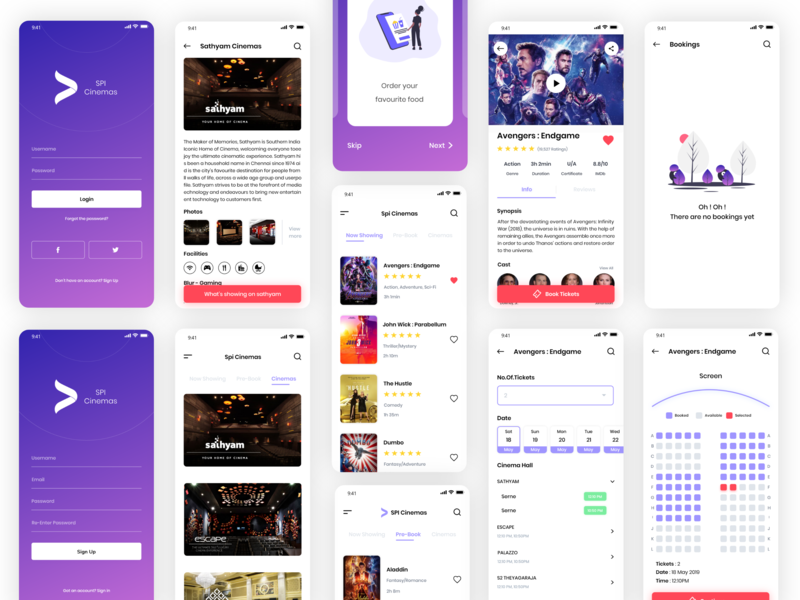
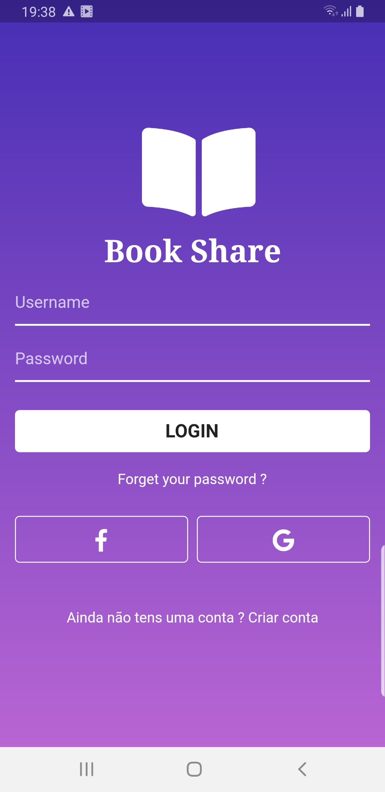
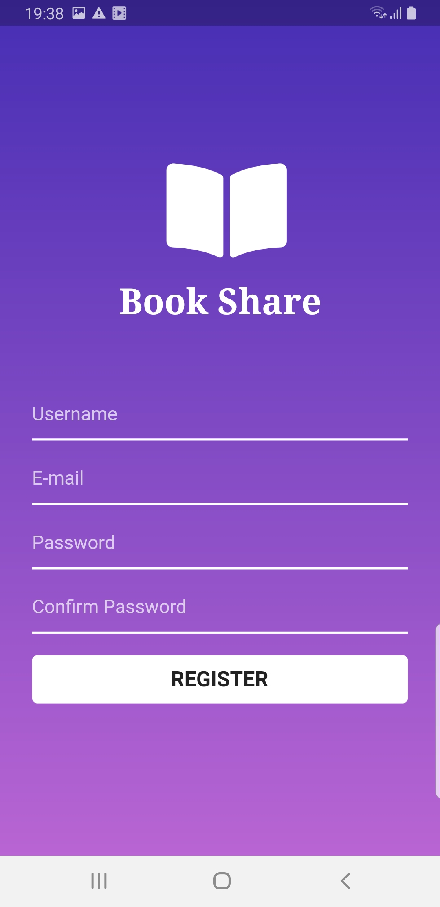

# bookshare

#Hack19 - International Flutter Hackathon

Local: Digital Factory 
Data: 01/06/2019

O desafio organizado pela Comunidade Internacional de Flutter será realizado em vários lugares do mundo no mesmo dia (Hoje) e tem como objetivo disseminar a nova tecnologia da Google.

A new Flutter project.

## Getting Started

This project is a starting point for a Flutter application.

A few resources to get you started if this is your first Flutter project:

- [Lab: Write your first Flutter app](https://flutter.dev/docs/get-started/codelab)
- [Cookbook: Useful Flutter samples](https://flutter.dev/docs/cookbook)

For help getting started with Flutter, view our 
[online documentation](https://flutter.dev/docs), which offers tutorials, 
samples, guidance on mobile development, and a full API reference.
